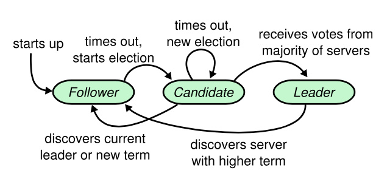
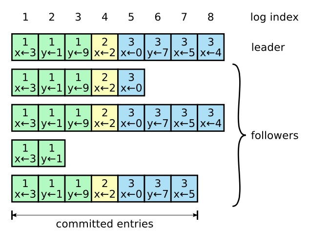

- [1. Etcd 学习](#1-etcd-学习)
  - [1.1. etcd特性](#11-etcd特性)
  - [1.2. 数据模型](#12-数据模型)
    - [1.2.1. 逻辑层](#121-逻辑层)
    - [1.2.2. 物理层](#122-物理层)
- [2. ETCD使用篇](#2-etcd使用篇)
  - [2.1. 简介](#21-简介)
  - [2.2. 安装](#22-安装)
    - [2.2.1. 使用可执行文件](#221-使用可执行文件)
    - [2.2.2. 源码编译](#222-源码编译)
    - [2.2.3. 通过GO Get](#223-通过go-get)
  - [2.3. 部署](#23-部署)
    - [2.3.1. 单机部署](#231-单机部署)
    - [2.3.2. 集群部署](#232-集群部署)
    - [2.3.3. 部署配置文件](#233-部署配置文件)
      - [2.3.3.1. 成员配置参数](#2331-成员配置参数)
      - [2.3.3.2. 集群配置参数](#2332-集群配置参数)
      - [2.3.3.3. Proxy参数](#2333-proxy参数)
      - [2.3.3.4. Security参数](#2334-security参数)
      - [2.3.3.5. Logging参数](#2335-logging参数)
      - [2.3.3.6. Profiling参数](#2336-profiling参数)
      - [2.3.3.7. Auth参数](#2337-auth参数)
      - [2.3.3.8. 配置文件示例](#2338-配置文件示例)
  - [2.4. 使用](#24-使用)
    - [2.4.1. PUT](#241-put)
    - [2.4.2. GET](#242-get)
    - [2.4.3. DEL](#243-del)
    - [2.4.4. Txn](#244-txn)
    - [2.4.5. Watch](#245-watch)
    - [2.4.6. Lease](#246-lease)
    - [2.4.7. 分布式锁LOCK](#247-分布式锁lock)
    - [2.4.8. Election](#248-election)
    - [2.4.9. 查看集群状态](#249-查看集群状态)
    - [2.4.10. snapshot](#2410-snapshot)
    - [2.4.11. Auth](#2411-auth)
    - [监控](#监控)
- [ETCD之raft](#etcd之raft)
  - [Raft简介](#raft简介)
  - [Raft领导选举](#raft领导选举)
  - [Raft日志复制](#raft日志复制)
  - [Raft安全性](#raft安全性)
- [ETCD之raft源码解读](#etcd之raft源码解读)

# 1. Etcd 学习

## 1.1. etcd特性
- 扁平化的键值空间；
- 在compaction前保持历史数据；
- 支持范围查询；
- 使用Lease替换TTL；
- 使用Txn替换CAS/CAD；
- 支持多范围高效的监控；
- 所有的接口都支持RPC；
- 部分接口支持HTTP；

**注意：** 请求体最大为1M，如果超出限制将会被禁止。因为etcd是流式操作，太大的数据会阻塞别的请求。

## 1.2. 数据模型
etcd为经常改变的数据提供了可靠的存储和查询。etcd支持多版本数据，持久化存储和高并发。etcd中每个数据都有一个修订版本，修订版本从1开始，每次修改一个数据的时候并不会原地修改，而是会从新创建一个对象存储该数据并把修订版本号加一。由于修改并不是原地更新，为了防止空间不断增加，etcd会执行compact将每个数据当前版本之前的数据全部清除。
### 1.2.1. 逻辑层
从逻辑层面来看，etcd是一个扁平的值空间。值空间的数据按照key值排序，所以范围查询变得很简单。值空间里包含多个不同的修订版本，当store被创建的时候，每个修订版本的值都是1。每次原子操作都会创建一个新的版本，旧的版本不会被改变，而且还可以通过修订版本号继续被访问到。为了节省空间，可以通过执行了compact移除旧的修订版本。 版本号在集群的生命周期内是顺序增长的。

etcd中key的生命周期：每个key可能有一个或多个生命周期，创建和修改一个key都会为该key从新创建一个数据，并将修订版本加1.删除一个key时会为这个key创建一个状态位，通过重置这个key的版本号为0的方式结束一个key的生命周期。

### 1.2.2. 物理层
etcd将键值对存储在一个持久化的b+树中。为了效率，B+树中只存储了每个key的最新版本。每个修订版本可能对应B+树中多个的key。
etcd的键值对其实是一个3元组(major, sub, type), major是key的版本号，sub是key的唯一标识，type代表该key的状态(例如被删除)。 为了加快查询，etcd在内存中也保持了一个btree索引。btree索引中的值是用户定义的关键字，值是一个指向持久化B+树中修改的指针。Compaction操作移除无效的指针。

# 2. ETCD使用篇
## 2.1. 简介
etcd是一个高度一致的分布式键值存储，它提供了一种可靠的方式来存储需要由分布式系统或机器集群访问的数据。 它可以优雅地处理网络分区期间的领导者选举，即使在领导者节点中也可以容忍机器故障。etcd的主要特性是：简单的API接口，可靠的键值对存储和可监控的方法。本文主要介绍了etcd的几种安装部署方式和一些基本的使用。
## 2.2. 安装
etcd的安装方式有官方提供的可执行文件和源码编译，建议使用官方提供的release版本的可执行文件。
### 2.2.1. 使用可执行文件
可以在该网址下载etcd可执行文件https://github.com/etcd-io/etcd/releases/， 例如
```bash
$ wget https://github.com/etcd-io/etcd/releases/download/v3.2.32/etcd-v3.2.32-linux-amd64.tar.gz
$ tar -xf etcd-v3.2.32-linux-amd64.tar.gz
$ cd etcd-v3.2.32-linux-amd64
# 查看etcd安装是否成功
$ ./etcd --version
```

### 2.2.2. 源码编译
```bash
# 不在GOPATH下编译
$ git clone https://github.com/etcd-io/etcd.git
$ cd etcd
$ ./build
$ ./bin/etcd --version
```

### 2.2.3. 通过GO Get
```bash
# GOPATH should be set
$ echo $GOPATH
/Users/example/go
$ go get -v go.etcd.io/etcd
$ go get -v go.etcd.io/etcd/etcdctl
$GOPATH/bin/etcd --version
```

## 2.3. 部署
### 2.3.1. 单机部署
```
$ ./etcd 
2021-05-07 12:38:52.527567 I | etcdmain: etcd Version: 3.2.32
2021-05-07 12:38:52.527698 I | etcdmain: Git SHA: 7dc07f2a9
2021-05-07 12:38:52.527705 I | etcdmain: Go Version: go1.12.17
2021-05-07 12:38:52.527712 I | etcdmain: Go OS/Arch: linux/amd64
2021-05-07 12:38:52.527716 I | etcdmain: setting maximum number of CPUs to 4, total number of available CPUs is 4
2021-05-07 12:38:52.527722 W | etcdmain: no data-dir provided, using default data-dir ./default.etcd
2021-05-07 12:38:52.528399 I | embed: listening for peers on http://localhost:2380
2021-05-07 12:38:52.528528 I | embed: listening for client requests on localhost:2379
2021-05-07 12:38:52.534008 I | etcdserver: name = default
2021-05-07 12:38:52.534086 I | etcdserver: data dir = default.etcd
2021-05-07 12:38:52.534091 I | etcdserver: member dir = default.etcd/member
2021-05-07 12:38:52.534095 I | etcdserver: heartbeat = 100ms
2021-05-07 12:38:52.534148 I | etcdserver: election = 1000ms
2021-05-07 12:38:52.534154 I | etcdserver: snapshot count = 100000
2021-05-07 12:38:52.534170 I | etcdserver: advertise client URLs = http://localhost:2379
2021-05-07 12:38:52.534177 I | etcdserver: initial advertise peer URLs = http://localhost:2380
2021-05-07 12:38:52.534212 I | etcdserver: initial cluster = default=http://localhost:2380
2021-05-07 12:38:52.537964 I | etcdserver: starting member 8e9e05c52164694d in cluster cdf818194e3a8c32
2021-05-07 12:38:52.538010 I | raft: 8e9e05c52164694d became follower at term 0
2021-05-07 12:38:52.538047 I | raft: newRaft 8e9e05c52164694d [peers: [], term: 0, commit: 0, applied: 0, lastindex: 0, lastterm: 0]
2021-05-07 12:38:52.538053 I | raft: 8e9e05c52164694d became follower at term 1
2021-05-07 12:38:52.543310 W | auth: simple token is not cryptographically signed
2021-05-07 12:38:52.545114 I | etcdserver: starting server... [version: 3.2.32, cluster version: to_be_decided]
2021-05-07 12:38:52.545604 I | etcdserver: 8e9e05c52164694d as single-node; fast-forwarding 9 ticks (election ticks 10)
2021-05-07 12:38:52.546145 I | etcdserver/membership: added member 8e9e05c52164694d [http://localhost:2380] to cluster cdf818194e3a8c32
2021-05-07 12:38:53.440095 I | raft: 8e9e05c52164694d is starting a new election at term 1
2021-05-07 12:38:53.440489 I | raft: 8e9e05c52164694d became candidate at term 2
2021-05-07 12:38:53.440906 I | raft: 8e9e05c52164694d received MsgVoteResp from 8e9e05c52164694d at term 2
2021-05-07 12:38:53.441043 I | raft: 8e9e05c52164694d became leader at term 2
2021-05-07 12:38:53.441099 I | raft: raft.node: 8e9e05c52164694d elected leader 8e9e05c52164694d at term 2
2021-05-07 12:38:53.442020 I | embed: ready to serve client requests
2021-05-07 12:38:53.442802 I | etcdserver: setting up the initial cluster version to 3.2
2021-05-07 12:38:53.442901 N | embed: serving insecure client requests on 127.0.0.1:2379, this is strongly discouraged!
2021-05-07 12:38:53.442939 I | etcdserver: published {Name:default ClientURLs:[http://localhost:2379]} to cluster cdf818194e3a8c32
2021-05-07 12:38:53.443339 N | etcdserver/membership: set the initial cluster version to 3.2
2021-05-07 12:38:53.443429 I | etcdserver/api: enabled capabilities for version 3.2
^C2021-05-07 12:40:41.122826 N | pkg/osutil: received interrupt signal, shutting down...
2021-05-07 12:40:41.123431 I | etcdserver: skipped leadership transfer for single member cluster
WARNING: 2021/05/07 12:40:41 grpc: addrConn.resetTransport failed to create client transport: connection error: desc = "transport: Error while dialing dial tcp: operation was canceled"; Reconnecting to {localhost:2379 0  <nil>}
WARNING: 2021/05/07 12:40:41 grpc: addrConn.transportMonitor exits due to: grpc: the connection is closing
```
**通过这中方式可以使用默认参数启动etcd，使用默认参数启动的etcd服务无法在别的服务器访问，若想在别的服务器访问需要添加listen-client-urls和advertise-client-urls，例如**
```bash
./etcd --isten-client-urls http://0.0.0.0:2379 --advertise-client-urls http://0.0.0.0:2379
```


### 2.3.2. 集群部署
```bash
TOKEN=token-01
CLUSTER_STATE=new
NAME_1=machine-1
NAME_2=machine-2
NAME_3=machine-3
HOST_1=10.240.0.17
HOST_2=10.240.0.18
HOST_3=10.240.0.19
CLUSTER=${NAME_1}=http://${HOST_1}:2380,${NAME_2}=http://${HOST_2}:2380,${NAME_3}=http://${HOST_3}:2380

# For machine 1
THIS_NAME=${NAME_1}
THIS_IP=${HOST_1}
etcd --data-dir=data.etcd --name ${THIS_NAME} \
	--initial-advertise-peer-urls http://${THIS_IP}:2380 --listen-peer-urls http://${THIS_IP}:2380 \
	--advertise-client-urls http://${THIS_IP}:2379 --listen-client-urls http://${THIS_IP}:2379 \
	--initial-cluster ${CLUSTER} \
	--initial-cluster-state ${CLUSTER_STATE} --initial-cluster-token ${TOKEN}

# For machine 2
THIS_NAME=${NAME_2}
THIS_IP=${HOST_2}
etcd --data-dir=data.etcd --name ${THIS_NAME} \
	--initial-advertise-peer-urls http://${THIS_IP}:2380 --listen-peer-urls http://${THIS_IP}:2380 \
	--advertise-client-urls http://${THIS_IP}:2379 --listen-client-urls http://${THIS_IP}:2379 \
	--initial-cluster ${CLUSTER} \
	--initial-cluster-state ${CLUSTER_STATE} --initial-cluster-token ${TOKEN}

# For machine 3
THIS_NAME=${NAME_3}
THIS_IP=${HOST_3}
etcd --data-dir=data.etcd --name ${THIS_NAME} \
	--initial-advertise-peer-urls http://${THIS_IP}:2380 --listen-peer-urls http://${THIS_IP}:2380 \
	--advertise-client-urls http://${THIS_IP}:2379 --listen-client-urls http://${THIS_IP}:2379 \
	--initial-cluster ${CLUSTER} \
	--initial-cluster-state ${CLUSTER_STATE} --initial-cluster-token ${TOKEN}
```

```bash
# 查看集群状态
./etcdctl --endpoints=$ENDPOINTS member list
```

### 2.3.3. 部署配置文件
#### 2.3.3.1. 成员配置参数
| 配置                    | 默认值                  | 环境变量                     | 解释                                          | 注                                  |
| ----------------------- | ----------------------- | ---------------------------- | --------------------------------------------- | ----------------------------------- |
| name                    | default                 | ETCD_NAME                    | 成员的名字                                    |                                     |
| data-dir                | "${name}.etcd"          | ETCD_DATA_DIR                | 数据文件                                      |                                     |
| wal-dir                 | ""                      | ETCD_WAL_DIR                 | wal目录                                       |                                     |
| snapshot-count          | "100000"                | ETCD_SNAPSHOT_COUNT          | 每多少条事务后执行一次snapshot                |                                     |
| heartbeat-interval      | "100"                   | ETCD_HEARTBEAT_INTERVAL      | 心跳周期（ms）                                |                                     |
| election-timeout        | "1000"                  | ETCD_ELECTION_TIMEOUT        | 选举超时时间（ms）                            |                                     |
| listen-peer-urls        | "http://localhost:2380" | ETCD_LISTEN_PEER_URLS        | List of URLs to listen on for peer traffic.   | 不能是域名，只可以是IP或者localhost |
| listen-client-urls      | "http://localhost:2379" | ETCD_LISTEN_CLIENT_URLS      | List of URLs to listen on for client traffic. | 不能是域名，只可以是IP或者localhost |
| max-snapshots           | 5                       | ETCD_MAX_SNAPSHOTS           | 要保留的snapshot数量                          |                                     |
| max-wals                | 5                       | ETCD_MAX_WALS                | 做多保留的wal数量                             |                                     |
| cors                    | ""                      | ETCD_CORS                    | 跨资源共享的以逗号分割的白名单列表            |                                     |
| quota-backend-bytes     | 0                       | ETCD_QUOTA_BACKEND_BYTES     | 服务占有资源超过给定配额时引发警报            |                                     |
| backend-batch-limit     | 0                       | ETCD_BACKEND_BATCH_LIMIT     | 一次提交的最大事务数量                        |                                     |
| backend-batch-interval  | 0                       | ETCD_BACKEND_BATCH_INTERVAL  | 一次提交最大时间间隔                          |                                     |
| max-txn-ops             | 128                     | ETCD_MAX_TXN_OPS             | 一次提交最多的事务数                          |                                     |
| max-request-bytes       | 1572864                 | ETCD_MAX_REQUEST_BYTES       | 客户端请求的最大size                          | 1.5Mb                               |
| grpc-keepalive-min-time | 5s                      | ETCD_GRPC_KEEPALIVE_MIN_TIME | 客户端向服务端发送探活的时间间隔              |                                     |
| grpc-keepalive-interval | 2h                      | ETCD_GRPC_KEEPALIVE_INTERVAL | 服务端向客户端探活的时间间隔                  |                                     |
| grpc-keepalive-timeout  | 20s                     | ETCD_GRPC_KEEPALIVE_TIMEOUT  | 响应超时时间                                  |                                     |

#### 2.3.3.2. 集群配置参数
| 配置                        | 默认值                          | 环境变量                         | 解释                                         | 注                                           |
| --------------------------- | ------------------------------- | -------------------------------- | -------------------------------------------- | -------------------------------------------- |
| initial-advertise-peer-urls | "http://localhost:2380"         | ETCD_INITIAL_ADVERTISE_PEER_URLS | 该成员的url，用于集群中其他的成员访问        | 可以包含域名，只要可以路由到集群中所有的成员 |
| initial-cluster             | "default=http://localhost:2380" | ETCD_INITIAL_CLUSTER             | 集群中所有成员的URLs                         |                                              |
| initial-cluster-state       | "new"                           | ETCD_INITIAL_CLUSTER_STATE       | 初始化集群状态（new和existing）              |                                              |
| initial-cluster-token       | etcd-cluster                    | ETCD_INITIAL_CLUSTER_TOKEN       | 集群token，一个集群中所有成员的token必须一致 |                                              |
| advertise-client-urls       | "http://localhost:2379"         | ETCD_ADVERTISE_CLIENT_URLS       | 此节点接受的客户端列表                       |                                              |


#### 2.3.3.3. Proxy参数
https://etcd.io/docs/v3.4/op-guide/configuration/
#### 2.3.3.4. Security参数
https://etcd.io/docs/v3.4/op-guide/configuration/
#### 2.3.3.5. Logging参数
https://etcd.io/docs/v3.4/op-guide/configuration/
#### 2.3.3.6. Profiling参数
| 配置                | 默认值 | 环境变量                 | 解释                                    | 注  |
| ------------------- | ------ | ------------------------ | --------------------------------------- | --- |
| enable-pprof        | false  | ETCD_ENABLE_PPROF        | URL + “/debug/pprof/”                   |     |
| metrics             | basic  | ETCD_METRICS             | 监控指标（basic｜extensive）            |     |
| listen-metrics-urls | ""     | ETCD_LISTEN_METRICS_URLS | 接受监控的IP列表，访问/metrics和/health |     |

#### 2.3.3.7. Auth参数
https://etcd.io/docs/v3.4/op-guide/configuration/

#### 2.3.3.8. 配置文件示例
```yaml
# This is the configuration file for the etcd server.

# Human-readable name for this member.
name: 'default'

# Path to the data directory.
data-dir:

# Path to the dedicated wal directory.
wal-dir:

# Number of committed transactions to trigger a snapshot to disk.
snapshot-count: 10000

# Time (in milliseconds) of a heartbeat interval.
heartbeat-interval: 100

# Time (in milliseconds) for an election to timeout.
election-timeout: 1000

# Raise alarms when backend size exceeds the given quota. 0 means use the
# default quota.
quota-backend-bytes: 0

# List of comma separated URLs to listen on for peer traffic.
listen-peer-urls: http://localhost:2380

# List of comma separated URLs to listen on for client traffic.
listen-client-urls: http://localhost:2379

# Maximum number of snapshot files to retain (0 is unlimited).
max-snapshots: 5

# Maximum number of wal files to retain (0 is unlimited).
max-wals: 5

# Comma-separated white list of origins for CORS (cross-origin resource sharing).
cors:

# List of this member's peer URLs to advertise to the rest of the cluster.
# The URLs needed to be a comma-separated list.
initial-advertise-peer-urls: http://localhost:2380

# List of this member's client URLs to advertise to the public.
# The URLs needed to be a comma-separated list.
advertise-client-urls: http://localhost:2379

# Discovery URL used to bootstrap the cluster.
discovery:

# Valid values include 'exit', 'proxy'
discovery-fallback: 'proxy'

# HTTP proxy to use for traffic to discovery service.
discovery-proxy:

# DNS domain used to bootstrap initial cluster.
discovery-srv:

# Initial cluster configuration for bootstrapping.
initial-cluster:

# Initial cluster token for the etcd cluster during bootstrap.
initial-cluster-token: 'etcd-cluster'

# Initial cluster state ('new' or 'existing').
initial-cluster-state: 'new'

# Reject reconfiguration requests that would cause quorum loss.
strict-reconfig-check: false

# Accept etcd V2 client requests
enable-v2: true

# Enable runtime profiling data via HTTP server
enable-pprof: true

# Valid values include 'on', 'readonly', 'off'
proxy: 'off'

# Time (in milliseconds) an endpoint will be held in a failed state.
proxy-failure-wait: 5000

# Time (in milliseconds) of the endpoints refresh interval.
proxy-refresh-interval: 30000

# Time (in milliseconds) for a dial to timeout.
proxy-dial-timeout: 1000

# Time (in milliseconds) for a write to timeout.
proxy-write-timeout: 5000

# Time (in milliseconds) for a read to timeout.
proxy-read-timeout: 0

client-transport-security:
  # Path to the client server TLS cert file.
  cert-file:

  # Path to the client server TLS key file.
  key-file:

  # Enable client cert authentication.
  client-cert-auth: false

  # Path to the client server TLS trusted CA cert file.
  trusted-ca-file:

  # Client TLS using generated certificates
  auto-tls: false

peer-transport-security:
  # Path to the peer server TLS cert file.
  cert-file:

  # Path to the peer server TLS key file.
  key-file:

  # Enable peer client cert authentication.
  client-cert-auth: false

  # Path to the peer server TLS trusted CA cert file.
  trusted-ca-file:

  # Peer TLS using generated certificates.
  auto-tls: false

# Enable debug-level logging for etcd.
debug: false

logger: zap

# Specify 'stdout' or 'stderr' to skip journald logging even when running under systemd.
log-outputs: [stderr]

# Force to create a new one member cluster.
force-new-cluster: false

auto-compaction-mode: periodic
auto-compaction-retention: "1"
```

## 2.4. 使用
etcd使用基本操作，增删改查、监听、事务操作、权限操作、snampshot
### 2.4.1. PUT
```bash
$ export ETCDCTL_API=3
$ export ENDPOINTS=http://127.0.0.1:2379
$ etcdctl --endpoints=$ENDPOINTS put foo "Hello World!"
OK

# 通过http方式插入键值
<<COMMENT
https://www.base64encode.org/
foo is 'Zm9v' in Base64
bar is 'YmFy'
COMMENT

curl -L http://localhost:2379/v3/kv/put \
  -X POST -d '{"key": "Zm9v", "value": "YmFy"}'
# {"header":{"cluster_id":"12585971608760269493","member_id":"13847567121247652255","revision":"2","raft_term":"3"}}
```


### 2.4.2. GET
```bash
$ etcdctl --endpoints=$ENDPOINTS get foo
foo
Hello World
$ etcdctl --endpoints=$ENDPOINTS --write-out="json" get foo
{"header":{"cluster_id":14841639068965178418,"member_id":10276657743932975437,"revision":2,"raft_term":3},"kvs":[{"key":"Zm9v","create_revision":2,"mod_revision":2,"version":1,"value":"SGVsbG8gV29ybGQ="}],"count":1}

curl -L http://localhost:2379/v3/kv/range \
  -X POST -d '{"key": "Zm9v"}'
# {"header":{"cluster_id":"12585971608760269493","member_id":"13847567121247652255","revision":"2","raft_term":"3"},"kvs":[{"key":"Zm9v","create_revision":"2","mod_revision":"2","version":"1","value":"YmFy"}],"count":"1"}


# 通过前缀获取所有符合条件的值
$ etcdctl --endpoints=$ENDPOINTS put web1 value1
OK
$ etcdctl --endpoints=$ENDPOINTS put web2 value2
OK
$ etcdctl --endpoints=$ENDPOINTS put web3 value3
OK
$ etcdctl --endpoints=$ENDPOINTS get web --prefix
web1
value1
web2
value2
web3
value3

# get all keys prefixed with "foo"
curl -L http://localhost:2379/v3/kv/range \
  -X POST -d '{"key": "Zm9v", "range_end": "Zm9w"}'
# {"header":{"cluster_id":"12585971608760269493","member_id":"13847567121247652255","revision":"2","raft_term":"3"},"kvs":[{"key":"Zm9v","create_revision":"2","mod_revision":"2","version":"1","value":"YmFy"}],"count":"1"}
```

### 2.4.3. DEL
```bash
$ etcdctl --endpoints=$ENDPOINTS del foo
1

# 通过前缀删除所有符合条件的值
$ etcdctl --endpoints=$ENDPOINTS get web --prefix
3
```

### 2.4.4. Txn
```bash
$ etcdctl --endpoints=$ENDPOINTS put user1 bad
$ etcdctl --endpoints=$ENDPOINTS txn --interactive

compares:
value("user1") = "bad"

success requests (get, put, delete):
del user1

failure requests (get, put, delete):
put user1 good

# target CREATE
curl -L http://localhost:2379/v3/kv/txn \
  -X POST \
  -d '{"compare":[{"target":"CREATE","key":"Zm9v","createRevision":"2"}],"success":[{"requestPut":{"key":"Zm9v","value":"YmFy"}}]}'
# {"header":{"cluster_id":"12585971608760269493","member_id":"13847567121247652255","revision":"3","raft_term":"2"},"succeeded":true,"responses":[{"response_put":{"header":{"revision":"3"}}}]}

# target VERSION
curl -L http://localhost:2379/v3/kv/txn \
  -X POST \
  -d '{"compare":[{"version":"4","result":"EQUAL","target":"VERSION","key":"Zm9v"}],"success":[{"requestRange":{"key":"Zm9v"}}]}'
# {"header":{"cluster_id":"14841639068965178418","member_id":"10276657743932975437","revision":"6","raft_term":"3"},"succeeded":true,"responses":[{"response_range":{"header":{"revision":"6"},"kvs":[{"key":"Zm9v","create_revision":"2","mod_revision":"6","version":"4","value":"YmF6"}],"count":"1"}}]}
```

### 2.4.5. Watch
监控一个key的变化
```bash
etcdctl --endpoints=$ENDPOINTS watch stock1
etcdctl --endpoints=$ENDPOINTS put stock1 1000

etcdctl --endpoints=$ENDPOINTS watch stock --prefix
etcdctl --endpoints=$ENDPOINTS put stock1 10
etcdctl --endpoints=$ENDPOINTS put stock2 20

curl -N http://localhost:2379/v3/watch \
  -X POST -d '{"create_request": {"key":"Zm9v"} }' &
# {"result":{"header":{"cluster_id":"12585971608760269493","member_id":"13847567121247652255","revision":"1","raft_term":"2"},"created":true}}

```

### 2.4.6. Lease
设置一个租期
```bash
# 设置；lease的租期为300s，超时后该lease下的所有key都将被删除，除非在超时前被续租了
etcdctl --endpoints=$ENDPOINTS lease grant 300
# lease 2be7547fbc6a5afa granted with TTL(300s)

etcdctl --endpoints=$ENDPOINTS put sample value --lease=2be7547fbc6a5afa
etcdctl --endpoints=$ENDPOINTS get sample

# 保持某个租期一直存活
etcdctl --endpoints=$ENDPOINTS lease keep-alive 2be7547fbc6a5afa
# 撤销一个租期
etcdctl --endpoints=$ENDPOINTS lease revoke 2be7547fbc6a5afa
etcdctl --endpoints=$ENDPOINTS get sample
```

### 2.4.7. 分布式锁LOCK

```bash
etcdctl --endpoints=$ENDPOINTS lock mutex1
```

### 2.4.8. Election

```
etcdctl --endpoints=$ENDPOINTS elect one p1

# another client with the same name blocks
etcdctl --endpoints=$ENDPOINTS elect one p2
```

### 2.4.9. 查看集群状态
``` bash
$ etcdctl --write-out=table --endpoints=$ENDPOINTS endpoint status

+-----------------------+------------------+---------+---------+-----------+-----------+------------+
|       ENDPOINT        |        ID        | VERSION | DB SIZE | IS LEADER | RAFT TERM | RAFT INDEX |
+-----------------------+------------------+---------+---------+-----------+-----------+------------+
| http://127.0.0.1:2379 | 8e9e05c52164694d |  3.2.32 |   25 kB |      true |         3 |         29 |
+-----------------------+------------------+---------+---------+-----------+-----------+------------+


$ etcdctl --endpoints=$ENDPOINTS endpoint health

http://127.0.0.1:2379 is healthy: successfully committed proposal: took = 1.221ms
```

### 2.4.10. snapshot
```bash
$ etcdctl --endpoints=$ENDPOINTS snapshot save my.db

Snapshot saved at my.db

$ etcdctl --write-out=table --endpoints=$ENDPOINTS snapshot status my.db

+---------+----------+------------+------------+
|  HASH   | REVISION | TOTAL KEYS | TOTAL SIZE |
+---------+----------+------------+------------+
| 1097733 |       13 |         18 |      25 kB |
+---------+----------+------------+------------+

```

### 2.4.11. Auth
etcd有一个特殊的用户`root`和一个特殊的角色`root`, 用户`root`必须在激活etcd的认证权限之前创建，用户root必须拥有root角色，而且拥有etcd里面的所有权限。角色root可以赋给任何用户，角色root拥有全局读写权限，此外，root角色授予常规集群维护的特权，包括修改集群成员资格，对存储进行碎片整理以及做快照的权利。
```bash
# 查看用户列表
etcdctl --endpoints=${ENDPOINTS} user list
# 添加root用户
etcdctl --endpoints=${ENDPOINTS} user add root
# 开启etcd权限认证,开启后在执行命令的时候都需要使用账户和密码
etcdctl auth enable

# 查看role列表
etcdctl --endpoints=${ENDPOINTS} role list
# 添加root角色并授权读写键foo的权限
etcdctl --endpoints=${ENDPOINTS} role add root
etcdctl --endpoints=${ENDPOINTS} role grant-permission root readwrite foo
etcdctl --endpoints=${ENDPOINTS} role get root

# 将角色root赋予用户root，角色root拥有的权限都将赋予用户root
$ etcdctl --endpoints=${ENDPOINTS} user grant-role root root
$ etcdctl --endpoints=${ENDPOINTS} user get root

User: root
Roles: root

etcdctl --endpoints=${ENDPOINTS} --user=root:123 put foo bar
etcdctl --endpoints=${ENDPOINTS} get foo
etcdctl --endpoints=${ENDPOINTS} --user=root:123 get foo
etcdctl --endpoints=${ENDPOINTS} --user=root:123 get foo1

# Give read access to a key /foo
$ etcdctl role grant-permission myrolename read /foo

# Give read access to keys with a prefix /foo/. The prefix is equal to the range [/foo/, /foo0)
$ etcdctl role grant-permission myrolename --prefix=true read /foo/

# Give write-only access to the key at /foo/bar
$ etcdctl role grant-permission myrolename write /foo/bar

# Give full access to keys in a range of [key1, key5)
$ etcdctl role grant-permission myrolename readwrite key1 key5

# Give full access to keys with a prefix /pub/
$ etcdctl role grant-permission myrolename --prefix=true readwrite /pub/

# 取消角色的特权
$ etcdctl role revoke-permission myrolename /foo/bar
# 删除角色
$ etcdctl role delete myrolename 

# 取消etcd的权限认证 
$ etcdctl --user root:rootpw auth disable

# create root user
curl -L http://localhost:2379/v3/auth/user/add \
  -X POST -d '{"name": "root", "password": "pass"}'
# {"header":{"cluster_id":"14841639068965178418","member_id":"10276657743932975437","revision":"1","raft_term":"2"}}

# create root role
curl -L http://localhost:2379/v3/auth/role/add \
  -X POST -d '{"name": "root"}'
# {"header":{"cluster_id":"14841639068965178418","member_id":"10276657743932975437","revision":"1","raft_term":"2"}}

# grant root role
curl -L http://localhost:2379/v3/auth/user/grant \
  -X POST -d '{"user": "root", "role": "root"}'
# {"header":{"cluster_id":"14841639068965178418","member_id":"10276657743932975437","revision":"1","raft_term":"2"}}

# enable auth
curl -L http://localhost:2379/v3/auth/enable -X POST -d '{}'
# {"header":{"cluster_id":"14841639068965178418","member_id":"10276657743932975437","revision":"1","raft_term":"2"}}

# get the auth token for the root user
curl -L http://localhost:2379/v3/auth/authenticate \
  -X POST -d '{"name": "root", "password": "pass"}'
# {"header":{"cluster_id":"14841639068965178418","member_id":"10276657743932975437","revision":"1","raft_term":"2"},"token":"sssvIpwfnLAcWAQH.9"}

curl -L http://localhost:2379/v3/kv/put \
  -H 'Authorization : sssvIpwfnLAcWAQH.9' \
  -X POST -d '{"key": "Zm9v", "value": "YmFy"}'
# {"header":{"cluster_id":"14841639068965178418","member_id":"10276657743932975437","revision":"2","raft_term":"2"}}
```
### 监控
```bash
PROMETHEUS_VERSION="2.0.0"
wget https://github.com/prometheus/prometheus/releases/download/v$PROMETHEUS_VERSION/prometheus-$PROMETHEUS_VERSION.linux-amd64.tar.gz -O /tmp/prometheus-$PROMETHEUS_VERSION.linux-amd64.tar.gz
tar -xvzf /tmp/prometheus-$PROMETHEUS_VERSION.linux-amd64.tar.gz --directory /tmp/ --strip-components=1
/tmp/prometheus -version

cat > /tmp/test-etcd.yaml <<EOF
global:
  scrape_interval: 10s
scrape_configs:
  - job_name: test-etcd
    static_configs:
    - targets: ['localhost:2379']
EOF
cat /tmp/test-etcd.yaml

nohup /tmp/prometheus \
    -config.file /tmp/test-etcd.yaml \
    -web.listen-address ":9090" \
    -storage.local.path "test-etcd.data" >> /tmp/test-etcd.log  2>&1 &

# 配置grafana，dashboard选择3070

wget https://dl.grafana.com/oss/release/grafana-7.5.4.linux-amd64.tar.gz
tar -zxvf grafana-7.5.4.linux-amd64.tar.gz
cd grafana-7.5.4 && ./bin/grafana-server

# dashboard id: 3070
```

# ETCD之raft
> raft https://raft.github.io/
> raft-zh_cn https://github.com/maemual/raft-zh_cn/blob/master/raft-zh_cn.md
## Raft简介
ETCD的高可用稳定存储是依赖raft实现的，Raft是一种共识算法，在容错性和性能上与Paxos等效，不同之处在于raft将复杂的分布式一致性问题分解为相对独立的子问题，领导选举、日志复制和安全性。分布式系统容错的一个基本问题就说是共识，共识需要分布式服务系统中的节点达成一致。raft要求只有获取集群中一半以上的节点的投票才会真的执行这个提案。当集群中超过一半的节点死掉的时候，集群将不能在执行新的提案。例如，即使2台服务器发生故障，包含5台服务器的群集也可以继续运行。 如果更多服务器发生故障，它们将停止提供服务（但绝不会返回错误的结果）。Raft 算法在许多方面和现有的一致性算法都很相似（主要是 Oki 和 Liskov 的 Viewstamped Replication），但是它也有一些独特的特性：
- **强领导者：**和其他一致性算法相比，Raft 使用一种更强的领导能力形式。比如，日志条目只从领导者发送给其他的服务器。这种方式简化了对复制日志的管理并且使得 Raft 算法更加易于理解。
- **领导选举：**Raft 算法使用一个随机计时器来选举领导者。这种方式只是在任何一致性算法都必须实现的心跳机制上增加了一点机制。在解决冲突的时候会更加简单快捷。
- **成员关系调整：**Raft 使用一种共同一致的方法来处理集群成员变换的问题，在这种方法下，处于调整过程中的两种不同的配置集群中大多数机器会有重叠，这就使得集群在成员变换的时候依然可以继续工作。

Raft 通过选举一个高贵的领导人，然后给予他全部的管理复制日志的责任来实现一致性。领导人从客户端接收日志条目(log entries)，把日志条目复制到其他服务器上，并且当保证安全性的时候告诉其他的服务器应用日志条目到他们的状态机中。拥有一个领导人大大简化了对复制日志的管理。例如，领导人可以决定新的日志条目需要放在日志中的什么位置而不需要和其他服务器商议，并且数据都从领导人流向其他服务器。一个领导人可能会宕机，或者和其他服务器失去连接，在这种情况下一个新的领导人会被选举出来。通过领导人的方式，Raft 将一致性问题分解成了三个相对独立的子问题，这些问题会在接下来的子章节中进行讨论。
## Raft领导选举
在集群中的每一个节点都是处于三个状态之一的：领导者，追随者和候选者。领导者是一个集群的老大，通常情况下一个集群只有一个领导者，所有的请求都是由领导者处理并通过发送心跳同步给他的追随者。追随者都是被动的，不主动发送请求，只接受来自领导者或候选者的请求。当候选者长时间没有接收到领导着的心跳，那么它就会成为候选者，将自己的任期号加1，并向集群中别的节点发起选举。他们直接的转换关系如下：
  
当现存的领导人宕机的时候, 一个新的领导人需要被选举出来。Raft 使用一种心跳机制来触发领导人选举。当服务器程序启动时，他们都是跟随者身份。一个服务器节点继续保持着跟随者状态只要他从领导人或者候选者处接收到有效的 RPCs。领导者周期性的向所有跟随者发送心跳包（即不包含日志项内容的附加日志项 RPCs）来维持自己的权威。如果一个跟随者在一段时间里没有接收到任何消息，也就是选举超时，那么他就会认为系统中没有可用的领导者,并且发起选举以选出新的领导者。

追随者一旦超时没有接收到来自领导者的消息，就会将自身的任期加一，然后成为候选者并向集群里的其他成员发送选举投票，在此期间的几种情况：
- 候选者在成为领导者之前收到了领导者的心跳信息
  - 领导者的任期大于等于当前节点，则当前节点直接成为领导者的追随者；
  - 领导者的任期小于当前节点，则拒绝此消息，继续为候选者；
- 候选者收到了半数以上的投票成为了领导者；
- 候选者没有获得半数以上的选票落选了，成为了别人的追随者

为了避免有多个候选者同时发起投票导致选票被瓜分，为了阻止选票起初就被瓜分，选举超时时间是从一个固定的区间（例如 150-300 毫秒）随机选择。这样可以把服务器都分散开以至于在大多数情况下只有一个服务器会选举超时；然后他赢得选举并在其他服务器超时之前发送心跳包。

## Raft日志复制
一旦一个领导人被选举出来，他就开始为客户端提供服务。客户端的每一个请求都包含一条被复制状态机执行的指令。领导人把这条指令作为一条新的日志条目附加到日志中去，然后并行的发起附加条目 RPCs 给其他的服务器，让他们复制这条日志条目。当这条日志条目被安全的复制（下面会介绍），领导人会应用这条日志条目到它的状态机中然后把执行的结果返回给客户端。如果跟随者崩溃或者运行缓慢，再或者网络丢包，领导人会不断的重复尝试附加日志条目 RPCs （尽管已经回复了客户端）直到所有的跟随者都最终存储了所有的日志条目。
  

## Raft安全性


# ETCD之raft源码解读

`StartNode`方法根据配置文件生成raft对象和rawnode对象，`rn.Bootstrap(peers)`初始化rawnode，发送add member命令给集群中的其他节点，并把所有节点添加到自己的分组内。
**这里的发送只是将请求追加到raftlog的ustable日志里，并没有真正的发送**

```go
# etcd/raft/node.go
func StartNode(c *Config, peers []Peer) Node {
	if len(peers) == 0 {
		panic("no peers given; use RestartNode instead")
	}
	rn, err := NewRawNode(c)
	if err != nil {
		panic(err)
	}
	rn.Bootstrap(peers)

	n := newNode(rn)

	go n.run()
	return &n
}
```