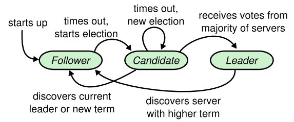
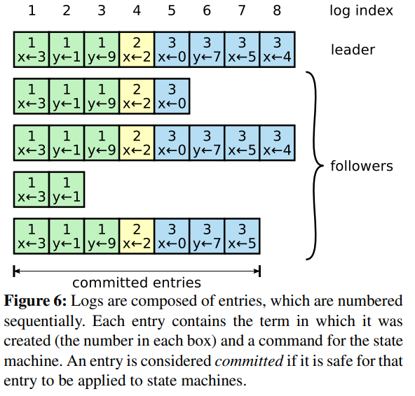
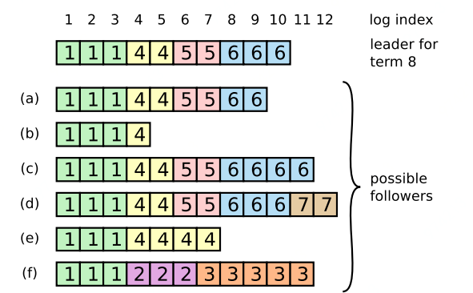
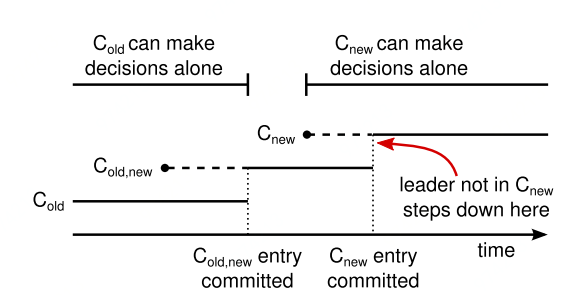

# raft论文解读及应用

[TOC]

## raft是什么？

raft是一种为了管理复制日志的一致性算法，提供了一种计算系统集群中分布状态机的通用方法，确保集群中每个节点都保持相同的状态。简单来说，就是实现分布式系统不同节点状态保持一致的算法。raft具有和Paxos相同的功能和性能，却比Paxos更加容易理解和实现(构建实际系统)。raft将一致性算法分为三个关键模块：领导人选举、日志复制和安全性。raft通过强一致性来减少需要考虑的状态的数量。

与其他一致性算法相比，raft的特性包括：

- **强领导者：**raft要求日志条目只能由leader发送给其他节点；
- **领导选举：**raft使用一个随机计时器来选举leader。当集群中找不到leader的时候，所有节点随机启动一个计时器，计时时间为150到300ms，某节点倒计时结束就会成为候选者并发起投票，当投票数大于集群中一半的机器时候该节点成为leader并向集群中所有节点发送心跳。
- **成员关系调整：**Raft 使用一种共同一致的方法来处理集群成员变换的问题，在这种方法下，处于调整过程中的两种不同的配置集群中大多数机器会有重叠，这就使得集群在成员变换的时候依然可以继续工作。（这个没看懂）

## raft算法描述

1. 在一个Raft Group中，初始的状态是所有节点都是Follower。
2. 在经过随机的超时时长后某一个Follower开始Leader election并成为Leader。并向其它Follower发送心跳。
3. 客户端在请求Raft Group时只会将命令发送给Leader，Leader通过Log replication将Log entries复制到其他Follower。在收到超过半数的Follower复制成功的消息后commit该条Log entry并放到应用到状态机中。
4. 状态机执行命令成功后将结果返回客户端。
5. 任何节点在log[]队列增长到一定长度后将执行Snapshot操作。
6. 若Leader故障，最先超时的Follower变为Candidate发起Leader election。
7. 若Candidate成功成为Leader，执行2-4。若Split votes，重新开始Leader election。无论如何currentTerm加1。
8. 若超过半数节点故障，整个Raft Group将故障。（没有节点能成为Leader）
9. 节点故障后恢复，将接收当前Leader的心跳，发现currentTerm小于新Leader的currentTerm，自己变为Follower。
10. 网络分区故障后恢复，所有Follower都会回滚未commit的Log entries并从当前Leader处复制。

## raft基础

​		raft集群包含若干个节点，节点数一般为基数个，以保证选举时少数服从多数的机制。raft节点都分为三个状态：**leader**、**candidate**和**follow**，每个节点都处于其中**一个**状态。每个节点启动时都是follow状态，通过选举一个leader，然后给与它全部的管理复制日志的责任来实现一致性。leader从客户端接收日志条目，把日志条目复制到其他服务器上，并且当保证安全性的时候告诉其他节点应用日志到他们的状态机中。

​		从图中可以看出三个状态可以相互转换, follow如果没有收到心跳就会变成candidate状态，candidate状态如果获得集群中一半以上的选票支持就会变成leader状态，在成为leader状态前如果接收到不小于自身term的leader的心跳，就回退成follow状态。

​		raft节点间通过RPCs进行通信，基本的通信分为两个：请求投票通信(request vote RPCs)和日志复制通信(AppendEntries RPCs)。前者是候选人在选举期间发起的，后者是leader用于复制日志和提供一种心跳机制。要想了解这两个RPCs需要先介绍一些基本的概念。

### raft中一些基础概念

**每个节点的参数的意义**

| 状态               | 概念                                                         |
| ------------------ | ------------------------------------------------------------ |
| currentTerm        | 服务器最后一次知道的任期号（初始化为 0，持续递增）           |
| votedFor           | 在当前获得选票的候选人的 Id                                  |
| log[]              | 日志条目集；每一个条目包含一个用户状态机执行的指令，和收到时的任期号 |
| commitIndex        | 已知的最大的已经被提交的日志条目的索引值                     |
| lastApplied        | 最后被应用到状态机的日志条目索引值（初始化为 0，持续递增）   |
| nextIndex(leader)  | 对于每一个服务器，需要发送给他的下一个日志条目的索引值（初始化为领导人最后索引值加一） |
| matchIndex(leader) | 对于每一个服务器，已经复制给他的日志的最高索引值             |

### 日志复制

​		通信(AppendEntries RPCs)过程中，raft中leader向其他节点发送日志的指令数据格式，包含在heartbeat里。客户端的每一个请求都包含一条被复制状态机执行的指令。领导人把这条指令作为一条新的日志条目附加到日志中去，然后并行的发起附加条目 RPCs 给其他的服务器，让他们复制这条日志条目。当这条日志条目被安全的复制（下面会介绍），领导人会应用这条日志条目到它的状态机中然后把执行的结果返回给客户端。如果跟随者崩溃或者运行缓慢，再或者网络丢包，领导人会不断的重复尝试附加日志条目 RPCs （尽管已经回复了客户端）直到所有的跟随者都最终存储了所有的日志条目。

raft有着以下两个定理

- 如果在不同的日志中的两个条目拥有相同的索引和任期号，那么他们存储了相同的指令。
- 如果在不同的日志中的两个条目拥有相同的索引和任期号，那么他们之前的所有日志条目也全部相同。

| 参数         | 解释                                                         |
| ------------ | ------------------------------------------------------------ |
| term         | 领导人的任期号                                               |
| leaderId     | 领导人的 Id，以便于跟随者重定向请求                          |
| prevLogIndex | 新的日志条目紧随之前的索引值                                 |
| prevLogTerm  | prevLogIndex 条目的任期号                                    |
| entries[]    | 准备存储的日志条目（表示心跳时为空；一次性发送多个是为了提高效率） |
| leaderCommit | 领导人已经提交的日志的索引值                                 |

| 返回值  | 解释                                                        |
| ------- | ----------------------------------------------------------- |
| term    | 当前的任期号，用于领导人去更新自己                          |
| success | 跟随者包含了匹配上 prevLogIndex 和 prevLogTerm 的日志时为真 |

接收者实现

1. 如果term<currentTerm,则代表新接收到的leader过期了，返回当前的currentTerm和false
2. 如果节点的第prevLogIndex条目的term号不等于接受到的prevLogTerm，则返回false
3. 如果新接收的日志条目的索引在该节点已经存在，则删除该节点这一条以及这一条之后的所有日志<!--个人理解：由于raft选举的策略，使得leader的commitIndex永远是最大的，而日志的id肯定大于commitIndex，所以follow节点上日志id大于接收到的日志id的日志一定没有被commit和应用的状态机中，所以直接删除不会导致数据不一致-->
4. 如果`leaderCommit>节点的commitIndex`，另`commitIndex=min(leaderCommit, 新日志索引)`

如果接受者返回true，则认为日志复制成功，leader收到集群中半数以上的成功消息，则提交这次日志并应用到状态机中，把commitIndex通过下次心跳传递给集群中的其他节点。如果接收者返回的false，当term大于leader的term时候leader退位并更新自己的term，等待新的leader的指令，当term等于leader的term时，减小nextIndex并从新发送，一直重复上面过程直到leader日志复制成功<!--领导人针对每一个跟随者维护了一个 **nextIndex**，这表示下一个需要发送给跟随者的日志条目的索引地址-->。

日志复制过程中可能会出现各种场景，如下图，节点f在成为第2任领导的时候接收到了三条日志，在commit之前崩溃了，后又很快重启并重新选举成第三任leader，接收了5条日志然后又没提交就挂掉了。日志复制出现问题时，raft采用强制将不一致的节点上的日志删除并将当前leader的日志拷贝过去。

### 领导选举请求投票通信(request vote RPCs)

| 参数         | 解释                         |
| ------------ | ---------------------------- |
| term         | 候选人的任期号               |
| candidateId  | 请求选票的候选人的 Id        |
| lastLogIndex | 候选人的最后日志条目的索引值 |
| lastLogTerm  | 候选人最后日志条目的任期号   |

| 返回值      | 解释                                       |
| ----------- | ------------------------------------------ |
| term        | 当前任期号，以便于候选人去更新自己的任期号 |
| voteGranted | 候选人赢得了此张选票时为真                 |

接收者实现：

1. 如果`term < currentTerm`返回 false
2. 如果 votedFor 为空或者为 candidateId，并且候选人的日志至少和自己一样新，那么就投票给他

**所有服务器需遵守的规则**：

所有服务器：

- 如果`commitIndex > lastApplied`，那么就 lastApplied 加一，并把`log[lastApplied]`应用到状态机中（5.3 节）
- 如果接收到的 RPC 请求或响应中，任期号`T > currentTerm`，那么就令 currentTerm 等于 T，并切换状态为跟随者

跟随者：

- 响应来自候选人和领导者的请求
- 如果在超过选举超时时间的情况之前没有收到**当前领导人**（即该领导人的任期需与这个跟随者的当前任期相同）的心跳/附加日志，或者是给某个候选人投了票，就自己变成候选人

候选人：

- 在转变成候选人后就立即开始选举过程
  1. 自增当前的任期号（currentTerm）
  2. 给自己投票
  3. 重置选举超时计时器
  4. 发送请求投票的 RPC 给其他所有服务器
- 如果接收到大多数服务器的选票，那么就变成领导人
- 如果接收到来自新的领导人的附加日志 RPC，转变成跟随者
- 如果选举过程超时，再次发起一轮选举

领导人：

- 一旦成为领导人：发送空的附加日志 RPC（心跳）给其他所有的服务器；在一定的空余时间之后不停的重复发送，以阻止跟随者超时（5.2 节）
- 如果接收到来自客户端的请求：附加条目到本地日志中，在条目被应用到状态机后响应客户端。<!--我的理解：leader接收到客户端的请求后，首先将日志写到本地日志条目中，然后随着heartbeat将这次心跳期间收到的所有日志发送给其他节点，等到集群中大部分节点返回的时候，新增加commitIndex，然后将该日志条目应用到状态机中后响应客户端，并将commitIndex随着下次心跳发给其他节点。-->
- 如果follow节点的最后一条日志索引nextIndex小于leader发来日志条目的索引值，那么leader将从nextIndex开始的日志从新发送一遍
- 如果存在一个满足`N > commitIndex`的 N，并且大多数的`matchIndex[i] ≥ N`成立，并且`log[N].term == currentTerm`成立，那么令 commitIndex 等于这个 N 

### 安全性

**选举限制：**leader必须存储集群所有已提交的日志，leader不会覆盖自身以存在的日志<!--经过多次试验，候选者的last log index如果小于投票者的话，投票的节点会拒绝给候选者投票-->

**提交之前任期内的日志条目**：当领导人复制之前任期里的日志时，Raft 会为所有日志保留原始的任期号, 这在提交规则上产生了额外的复杂性。

**安全性验证：**term大的leader一定包含之前leader已经提交的日志<!--既然日志被提交，那么肯定先复制到了半数以上的节点上，那么没有该条日志的节点成为候选者的时候就不可能获得半数以上选民的支持-->

最后，Raft 要求服务器按照日志中索引位置顺序应用日志条目。和状态机安全特性结合起来看，这就意味着所有的服务器会应用相同的日志序列集到自己的状态机中，并且是按照相同的顺序。

## follow和candidate节点崩溃

leader发送的复制日志RPCs没有返回，leader会无限重试这条日志，如果又返回但是结果是false那么leader会将nextIndex-1，再次发送新的日志条目，重复上述过程直至成功。

## 集群成员变化

集群数量发生改变的时候，要避免转换的过程中存在任何时间点使得两个领导人同时被选举成功在同一个任期里。所以必须采用龄阶段的方法：停掉旧的配置，然后启用新的配置。在 Raft 中，集群先切换到一个过渡的配置，我们称之为共同一致；一旦共同一致已经被提交了，那么系统就切换到新的配置上。共同一致是老配置和新配置的结合：

- 日志条目被复制给集群中新、老配置的所有服务器。
- 新、旧配置的服务器都可以成为领导人。
- 达成一致（针对选举和提交）需要分别在两种配置上获得大多数的支持。

共同一致允许独立的服务器在不影响安全性的前提下，在不同的时间进行配置转换过程。此外，共同一致可以让集群在配置转换的过程中依然响应客户端的请求。

## 日志压缩

Raft 的日志在正常操作中不断的增长，但是在实际的系统中，日志不能无限制的增长。随着日志不断增长，他会占用越来越多的空间，花费越来越多的时间来重置。如果没有一定的机制去清除日志里积累的陈旧的信息，那么会带来可用性问题。

快照是最简单的压缩方法。在快照系统中，整个系统的状态都以快照的形式写入到稳定的持久化存储中，然后到那个时间点之前的日志全部丢弃。

每个服务器独立的创建快照，只包括已经被提交的日志。主要的工作包括将状态机的状态写入到快照中。Raft 也包含一些少量的元数据到快照中：**最后被包含索引**指的是被快照取代的最后的条目在日志中的索引值（状态机最后应用的日志），**最后被包含的任期**指的是该条目的任期号。保留这些数据是为了支持快照后紧接着的第一个条目的附加日志请求时的一致性检查，因为这个条目需要前一日志条目的索引值和任期号。为了支持集群成员更新（第 6 节），快照中也将最后的一次配置作为最后一个条目存下来。一旦服务器完成一次快照，他就可以删除最后索引位置之前的所有日志和快照了。

尽管通常服务器都是独立的创建快照，但是领导人必须偶尔的发送快照给一些落后的跟随者。这通常发生在当领导人已经丢弃了下一条需要发送给跟随者的日志条目的时候。幸运的是这种情况不是常规操作：一个与领导人保持同步的跟随者通常都会有这个条目。然而一个运行非常缓慢的跟随者或者新加入集群的服务器（第 6 节）将不会有这个条目。这时让这个跟随者更新到最新的状态的方式就是通过网络把快照发送给他们。

**安装快照 RPC**：

由领导人调用以将快照的分块发送给跟随者。领导者总是按顺序发送分块。

| 参数              | 解释                                |
| ----------------- | ----------------------------------- |
| term              | 领导人的任期号                      |
| leaderId          | 领导人的 Id，以便于跟随者重定向请求 |
| lastIncludedIndex | 快照中包含的最后日志条目的索引值    |
| lastIncludedTerm  | 快照中包含的最后日志条目的任期号    |
| offset            | 分块在快照中的字节偏移量            |
| data[]            | 从偏移量开始的快照分块的原始字节    |
| done              | 如果这是最后一个分块则为 true       |

| 结果 | 解释                                          |
| ---- | --------------------------------------------- |
| term | 当前任期号（currentTerm），便于领导人更新自己 |

**接收者实现**：

1. 如果`term < currentTerm`就立即回复
2. 如果是第一个分块（offset 为 0）就创建一个新的快照
3. 在指定偏移量写入数据
4. 如果 done 是 false，则继续等待更多的数据
5. 保存快照文件，丢弃具有较小索引的任何现有或部分快照
6. 如果现存的日志条目与快照中最后包含的日志条目具有相同的索引值和任期号，则保留其后的日志条目并进行回复
7. 丢弃整个日志
8. 使用快照重置状态机（并加载快照的集群配置）

## 客户端交互

Raft 中的客户端发送所有请求给领导人。当客户端启动的时候，他会随机挑选一个服务器进行通信。如果客户端第一次挑选的服务器不是领导人，那么那个服务器会拒绝客户端的请求并且提供他最近接收到的领导人的信息（附加条目请求包含了领导人的网络地址）。如果领导人已经崩溃了，那么客户端的请求就会超时；客户端之后会再次重试随机挑选服务器的过程。

## 参考文献

论文地址：[In Search of an Understandable Consensus Algorithm](https://raft.github.io/raft.pdf).

[raft论文中文翻译](https://github.com/maemual/raft-zh_cn/blob/master/raft-zh_cn.md)

[raft官方网站](https://raft.github.io/)

[raft动态图](http://thesecretlivesofdata.com/raft/)

