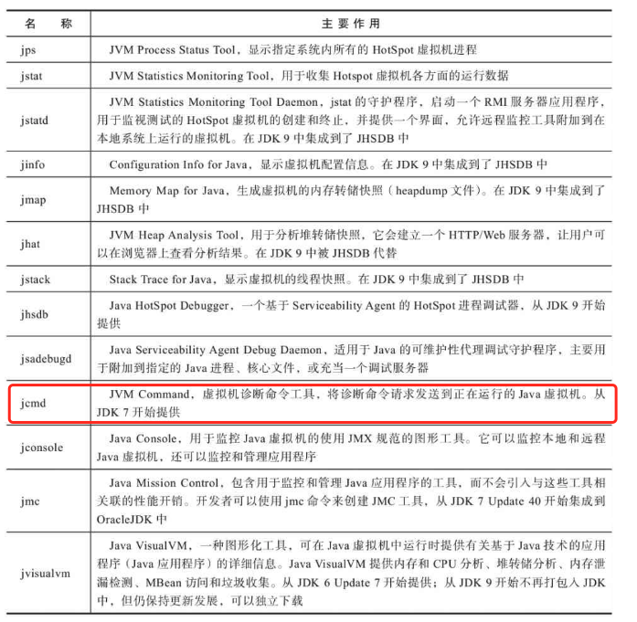

#! https://zhuanlan.zhihu.com/p/348345992
<!-- JVM 总结 -->
JVM全称(java virtual machine, java虚拟机)的缩写， JVM是一种用于计算设备的规范，是一个虚构出来的计算机，通过在实际的计算机上仿真模拟实际的计算机功能来实现的。JVM包括一套字节码指令集，一组寄存器，一个栈，一个垃圾回收堆和一个存储方法域。JVM屏蔽了具体的操作系统平台相关的信息，使java程序只需要生成在java虚拟机上运行的目标代码，即字节码，就可以在多个平台不加修改的运行，JVM在执行字节码时，实际上还是解释成具体平台上的机器指令执行。

- [1. 什么是JVM](#1-什么是jvm)
- [2. JRE/JDK/JVM是什么关系](#2-jrejdkjvm是什么关系)
- [3. JVM原理](#3-jvm原理)
  - [3.1. 内存管理](#31-内存管理)
    - [3.1.1. HotSpot虚拟机对象探秘](#311-hotspot虚拟机对象探秘)
      - [3.1.1.1. 对象的创建](#3111-对象的创建)
      - [3.1.1.2. 对象的内存布局](#3112-对象的内存布局)
      - [3.1.1.3. 对象的访问](#3113-对象的访问)
  - [3.2. 垃圾收集器与内存分配策略](#32-垃圾收集器与内存分配策略)
    - [3.2.1. 对象死亡](#321-对象死亡)
      - [3.2.1.1. 回收方法区](#3211-回收方法区)
    - [3.2.2. 垃圾收集算法](#322-垃圾收集算法)
      - [3.2.2.1. 标记-清除算法](#3221-标记-清除算法)
      - [3.2.2.2. 标记-复制算法](#3222-标记-复制算法)
      - [3.2.2.3. 标记-整理算法](#3223-标记-整理算法)
  - [3.3. 虚拟机性能监控、故障处理工具](#33-虚拟机性能监控故障处理工具)
    - [3.3.1. jps:虚拟机进程状况工具](#331-jps虚拟机进程状况工具)
    - [3.3.2. jstat:虚拟机统计信息监视工具](#332-jstat虚拟机统计信息监视工具)
    - [3.3.3. jinfo:Java配置信息工具](#333-jinfojava配置信息工具)
    - [3.3.4. jmap:Java内存映像工具](#334-jmapjava内存映像工具)
    - [3.3.5. jhat:虚拟机堆转储快照分析工具](#335-jhat虚拟机堆转储快照分析工具)
    - [3.3.6. jstack:Java堆栈跟踪工具](#336-jstackjava堆栈跟踪工具)
    - [3.3.7. 总结](#337-总结)
  
# 1. 什么是JVM
JVM全称(java virtual machine, java虚拟机)的缩写， JVM是一种用于计算设备的规范，是一个虚构出来的计算机，通过在实际的计算机上仿真模拟实际的计算机功能来实现的。JVM包括一套字节码指令集，一组寄存器，一个栈，一个垃圾回收堆和一个存储方法域。JVM屏蔽了具体的操作系统平台相关的信息，使java程序只需要生成在java虚拟机上运行的目标代码，即字节码，就可以在多个平台不加修改的运行，JVM在执行字节码时，实际上还是解释成具体平台上的机器指令执行。

# 2. JRE/JDK/JVM是什么关系
JRE(JavaRuntimeEnvironment，Java运行环境)，也就是Java平台。所有的Java 程序都要在JRE下才能运行。普通用户只需要运行已开发好的java程序，安装JRE即可。

JDK(Java Development Kit)是程序开发者用来来编译、调试java程序用的开发工具包。JDK的工具也是Java程序，也需要JRE才能运行。为了保持JDK的独立性和完整性，在JDK的安装过程中，JRE也是 安装的一部分。所以，在JDK的安装目录下有一个名为jre的目录，用于存放JRE文件。

JVM(JavaVirtualMachine，Java虚拟机)是JRE的一部分。它是一个虚构出来的计算机，是通过在实际的计算机上仿真模拟各种计算机功能来实现的。JVM有自己完善的硬件架构，如处理器、堆栈、寄存器等，还具有相应的指令系统。Java语言最重要的特点就是跨平台运行。使用JVM就是为了支持与操作系统无关，实现跨平台。

# 3. JVM原理
JVM是java的核心和基础，在java编译器和os平台之间的虚拟处理器。它是一种利用软件方法实现的抽象的计算机基于下层的操作系统和硬件平台，可以在上面执行java的字节码程序。

java编译器只要面向JVM生成字节码文件，JVM就可以将每条指令翻译成不同平台的机器码，在特定平台运行。

## 3.1. 内存管理 
Java虚拟机在执行Java程序的过程中会把他管理的内存内存划分成若干个区域，每个区域有各自的用途，以及创建和销毁时间，有些内存区域随着虚拟机进程的启动一直存在，有些区域则是依赖用户线程的启动和结束而建立和销毁。
  

* 程序计数器：当前线程所执行的字节码行号指示器，线程私有，唯一不会OutofMemoryError的区域。
* Java虚拟机栈：线程私有，用于存储局部变量表，操作数栈，动态连接和方法出口等信息。每个方法被调用到执行完毕的过程就对应着一个帧栈在虚拟机栈入栈到出栈的过程。当栈扩展时无法申请到内存就会抛出OOM的异常。
* 本地方法栈：线程私有，为虚拟机使用本地方法服务，本地方法栈也会在栈深度溢出或者栈扩展失 败时分别抛出StackOverflowError和OutOfMemoryError异常。（本地方法栈可能直接和虚拟机栈合二为一）
* Java堆：线程共享，用于存放对象实例。通过参数-Xmx和-Xms设定java堆的大小。如果在Java堆中没有内存完成实例分配，并且堆也无法再 扩展时，Java虚拟机将会抛出OutOfMemoryError异常。
* 方法区：线程共享，用于存储已被虚拟机加载 的类型信息、常量、静态变量、即时编译器编译后的代码缓存等数据。**之前方法区由永久代Java堆实现，后来由于容易造成内存溢出的问题，jdk6后逐步改为采用本地内存(Native Memory)来实现方法区的计划了，JDK7中已经将所有的方法区内容转到元空间中了。**
* 运行时常量池：是方法区的一部分，Class文件中除了有类的版本、字 段、方法、接口等描述信息外，还有一项信息是常量池表(Constant Pool Table)，用于存放编译期生 成的各种字面量与符号引用，这部分内容将在类加载后存放到方法区的运行时常量池中。当常量池无法再申请到内存 时会抛出OutOfMemoryError异常。
* 直接内存：直接内存(Direct Memory)并不是虚拟机运行时数据区的一部分，也不是《Java虚拟机规范》中 定义的内存区域。但是这部分内存也被频繁地使用，而且也可能导致OutOfMemoryError异常出现。

### 3.1.1. HotSpot虚拟机对象探秘
本节主要是讲一下对象的创建，布局和访问的过程。

#### 3.1.1.1. 对象的创建

**加载类信息**
当Java虚拟机遇到一条字节码new指令时，首先将去检查这个指令的参数是否能在常量池中定位到一个类的符号引用，并且检查这个符号引用代表的类是否已被加载、解析和初始化过。如果没有，那必须先执行相应的类加载过程，后面将继续探讨这部分细节。
**申请内存**
在类加载检查通过后，接下来虚拟机将为新生对象分配内存。分配方式有两种：**指针碰撞**和**空闲列表**。选择哪种分配方式由Java堆是否规整决定，而Java堆是否规整又由所采用 的垃圾收集器是否带有空间压缩整理(Comp act)的能力决定。因此，当使用Serial、ParNew等带压缩 整理过程的收集器时，系统采用的分配算法是指针碰撞，既简单又高效;而当使用CMS这种基于清除(Sweep)算法的收集器时，理论上就只能采用较为复杂的空闲列表来分配内存。
内存分配时如何保证线程安全：
* 一种是对分配内存空间的动作进行同步处理——实际上虚拟机是采用CAS配上失败 重试的方式保证更新操作的原子性;
* 另外一种是把内存分配的动作按照线程划分在不同的空间之中进行，即每个线程在Java堆中预先分配一小块内存，称为本地线程分配缓冲(Thread Local Allocation Buffer，TLAB)。

**初始化对象**
初始化对象，设置对象头，对象实例内容和内容填充。

#### 3.1.1.2. 对象的内存布局
在HotSpot虚拟机里，对象在堆内存中的存储布局可以划分为三个部分:对象头(Header)、实例数据(Instance Data)和对齐填充(Padding)。
**对象头**
对象头是由运行时数据信息(mark word)和类型指针(Klass Pointer)，当对象是数组时还会有(length field字段)。
在32位JVM中是这么存的
  
在64位JVM中是这么存的
  

Klass Pointer,即类型指针，是对象指向它的类元数据的指针，虚拟机通过这个指针来确定这个对象是哪个类的实例。

**实例数据**
如果对象有属性字段，则这里会有数据信息。如果对象无属性字段，则这里就不会有数据。根据字段类型的不同占不同的字节，例如boolean类型占1个字节，int类型占4个字节等等；

**对齐数据**
对象可以有对齐数据也可以没有。默认情况下，Java虚拟机堆中对象的起始地址需要对齐至8的倍数。如果一个对象用不到8N个字节则需要对其填充，以此来补齐对象头和实例数据占用内存之后剩余的空间大小。如果对象头和实例数据已经占满了JVM所分配的内存空间，那么就不用再进行对齐填充了。
所有的对象分配的字节总SIZE需要是8的倍数，如果前面的对象头和实例数据占用的总SIZE不满足要求，则通过对齐数据来填满。
> 为什么要对齐数据？字段内存对齐的其中一个原因，是让字段只出现在同一CPU的缓存行中。如果字段不是对齐的，那么就有可能出现跨缓存行的字段。也就是说，该字段的读取可能需要替换两个缓存行，而该字段的存储也会同时污染两个缓存行。这两种情况对程序的执行效率而言都是不利的。其实对其填充的最终目的是为了计算机高效寻址。

#### 3.1.1.3. 对象的访问
主流的访问方式主要有使用句柄和直接指针两种：
* 使用句柄来访问的最大好处就是reference中存储的是稳定句柄地 址，在对象被移动(垃圾收集时移动对象是非常普遍的行为)时只会改变句柄中的实例数据指针，而 reference本身不需要被修改。
* 使用直接指针来访问最大的好处就是速度更快，它节省了一次指针定位的时间开销，由于对象访 问在Java中非常频繁，因此这类开销积少成多也是一项极为可观的执行成本。

  

  

## 3.2. 垃圾收集器与内存分配策略
### 3.2.1. 对象死亡
* 引用技数算法：在对象中添加一个引用计数器，每当有一个地方 引用它时，计数器值就加一;当引用失效时，计数器值就减一;任何时刻计数器为零的对象就是不可 能再被使用的。
* 可达性分析算法：当前主流的商用程序语言(Java、C#，上溯至前面提到的古老的Lisp)的内存管理子系统，都是 通过可达性分析(Reachability Analysis)算法来判定对象是否存活的。这个算法的基本思路就是通过 一系列称为“GC Roots”的根对象作为起始节点集，从这些节点开始，根据引用关系向下搜索，搜索过 程所走过的路径称为“引用链”(Reference Chain)，如果某个对象到GC Roots间没有任何引用链相连， 或者用图论的话来说就是从GC Roots到这个对象不可达时，则证明此对象是不可能再被使用的。

* 强引用：是指在程序代码之中普遍存在的引用赋值；
* 软引用：是用来描述一些还有用，但非必须的对象。只被软引用关联着的对象，在系统将要发生内 存溢出异常前，会把这些对象列进回收范围之中进行第二次回收，如果这次回收还没有足够的内存， 才会抛出内存溢出异常。
* 弱引用：也是用来描述那些非必须对象，但是它的强度比软引用更弱一些，被弱引用关联的对象只 能生存到下一次垃圾收集发生为止。
* 虚引用：为一个对象设置虚引用关联的唯一目的只是为了能在这个对象被收集器回收时收到一个系统通知。

真正宣告一个对象死亡，至少要经历两次标记过程:如果对象在进行可达性分析后发现没 有与GC Roots相连接的引用链，那它将会被第一次标记，随后进行一次筛选，筛选的条件是此对象是 否有必要执行finalize()方法。如果这个对象被判定为确有必要执行finaliz e()方法，那么该对象将会被放置在一个名为F-Queue的 队列之中，并在稍后由一条由虚拟机自动建立的、低调度优先级的Finaliz er线程去执行它们的finaliz e() 方法。
  
#### 3.2.1.1. 回收方法区
方法区的垃圾收集主要回收两部分内容:废弃的常量和不再使用的类型。通常方法区是不需要垃圾回收的，只有在大量使用反射、动态代理、CGLib等字节码框架，动态生成JSP以及OSGi这类频繁自定义类加载器的场景中，通常都需要Java虚拟机具备类型卸载的能力，以保证不会对方法区造成过大的内存压力。

### 3.2.2. 垃圾收集算法
从如何判定对象消亡的角度出发，垃圾收集算法可以划分为“引用计数式垃圾收集”(Reference Counting GC)和“追踪式垃圾收集”(Tracing GC)两大类。
#### 3.2.2.1. 标记-清除算法
算法分为“标记”和“清除”两个阶段:首先标记出所有需要回 收的对象，在标记完成后，统一回收掉所有被标记的对象，也可以反过来，标记存活的对象，统一回 收所有未被标记的对象。它的主要缺点有两个:第一个是**执行效率不稳定**，如果Java堆中包含大量对 象，而且其中大部分是需要被回收的，这时必须进行大量标记和清除的动作，导致标记和清除两个过 程的执行效率都随对象数量增长而降低;第二个是**内存空间的碎片化问题**，标记、清除之后会产生大 量不连续的内存碎片，空间碎片太多可能会导致当以后在程序运行过程中需要分配较大对象时无法找 到足够的连续内存而不得不提前触发另一次垃圾收集动作。
**CMS标记清除算法牺牲了系统的吞吐量来追求收集速度，适合追求垃圾收集速度的服务器上。可以通过JVM启动参数：-XX:+UseConcMarkSweepGC来开启CMS。**

#### 3.2.2.2. 标记-复制算法
将可用内存按容量划分为大小相等的两块，每次只使用其中的一块。当这一块的内存用完了，就将还存活着的对象复制到另外一块上面，然后再把已使用过的内存空间一次清理掉。现在的商用Java虚拟机大多都优先采用了这种收集算法去回收新生代，IBM公司曾有一项专门研 究对新生代“朝生夕灭”的特点做了更量化的诠释——新生代中的对象有98%熬不过第一轮收集。因此 并不需要按照1∶1的比例来划分新生代的内存空间。**Appel式回收的具体做法是把新生代分为一块较大的Eden空间和两块较小的Survivor空间**，每次分配内存只使用Eden和其中一块Survivor。发生垃圾搜集时，将Eden和Survivor中仍 然存活的对象一次性复制到另外一块Survivor空间上，然后直接清理掉Eden和已用过的那块Survivor空间。HotSpot虚拟机默认Eden和Survivor的大小比例是8∶1，也即每次新生代中可用内存空间为整个新 生代容量的90%(Eden的80%加上一个Survivor的10%)，只有一个Survivor空间，即10%的新生代是会 被“浪费”的。
**缺点：浪费部分空间和如果对象存活率较高时就会进行较多的复制操作，效率将会降低。**
#### 3.2.2.3. 标记-整理算法
1974年Edward Lueders提出了另外一种有针对性的“标记-整 理”(Mark-Compact)算法，其中的标记过程仍然与“标记-清除”算法一样，但后续步骤不是直接对可 回收对象进行清理，而是让所有存活的对象都向内存空间一端移动，然后直接清理掉边界以外的内存。

**最新的ZGC和Shenandoah收集器使用读屏障(Read Barrier)技术实现了整理过程与用户线程的并发 执行，稍后将会介绍这种收集器的工作原理。**

## 3.3. 虚拟机性能监控、故障处理工具
给一个系统定位问题的时候，知识、经验是关键基础，数据是依据，工具是运用知识处理数据的 手段。这里说的数据包括但不限于异常堆栈、虚拟机运行日志、垃圾收集器日志、线程快照(threaddump /javacore文件)、堆转储快照(heap dump /hprof文件)等。

### 3.3.1. jps:虚拟机进程状况工具
jps(JVM Process Status Tool)它的功能也和p s命令类似:可以列出正在运行的虚拟机进程，并显示虚拟机执行主类(Main Class，main()函数所在的类)名称以及这些进程的本地虚拟机唯一ID(LVM ID，Local Virtual M achine Identifier)。
  

### 3.3.2. jstat:虚拟机统计信息监视工具
jstat(JVM Statistics M onitoring Tool)是用于监视虚拟机各种运行状态信息的命令行工具。它可以显示本地或者远程虚拟机进程中的类加载、内存、垃圾收集、即时编译等运行时数据，在没有 GUI图形界面、只提供了纯文本控制台环境的服务器上，它将是运行期定位虚拟机性能问题的常用工具。
  

### 3.3.3. jinfo:Java配置信息工具
jinfo(Configuration Info for Java)的作用是实时查看和调整虚拟机各项参数。使用jps命令的-v参数可以查看虚拟机启动时显式指定的参数列表，但如果想知道未被显式指定的参数的系统默认值，除了去找资料外，就只能使用jinfo的-flag选项进行查询了.

### 3.3.4. jmap:Java内存映像工具
jmap 的作用并不仅仅是为了获取堆转储快照，它还可以查询finaliz e执行队列、Java堆和方法区的 详细信息，如空间使用率、当前用的是哪种收集器等。
  

### 3.3.5. jhat:虚拟机堆转储快照分析工具
JDK提供jhat(JVM Heap Analysis Tool)命令与jmap搭配使用，来分析jmap生成的堆转储快照。

### 3.3.6. jstack:Java堆栈跟踪工具
jstack(Stack Trace for Java)命令用于生成虚拟机当前时刻的线程快照(一般称为threaddump或者 javacore文件)。线程快照就是当前虚拟机内每一条线程正在执行的方法堆栈的集合，生成线程快照的 目的通常是定位线程出现长时间停顿的原因，如线程间死锁、死循环、请求外部资源导致的长时间挂 起等，都是导致线程长时间停顿的常见原因。
从JDK 5起，java.lang.Thread类新增了一个getAllStackTraces()方法用于获取虚拟机中所有线程的StackTraceElement对象。使用这个方法可以通过简单的几行代码完成jstack的大部分功能，在实际项目中不妨调用这个方法做个管理员页面，可以随时使用浏览器来查看线程堆栈.

### 3.3.7. 总结
  
