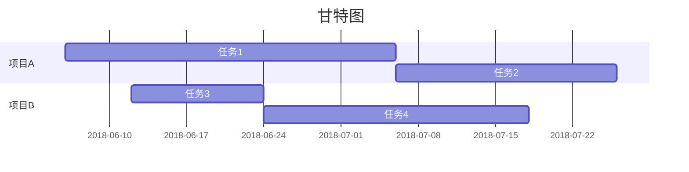
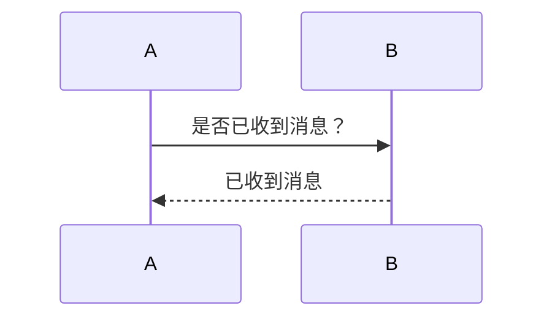
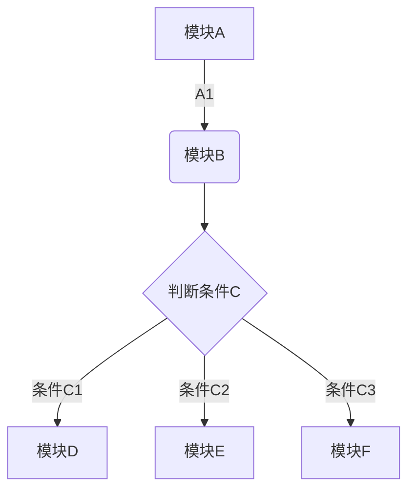

# Java编程思想阅读笔记

>**一切皆是对象**

## 基本概念
### 数据存储的位置

1. 寄存器：位于处理器内部，数量有限，根据需要由编译器分配；
2. 堆栈：位于常规RAM中，速度仅此于寄存器。基本类型的对象如int位于此；
3. 堆：内存池，也在RAM中，通过new申请内存空间；
4. 静态存储：位于RAM的固定位置，使用static标志一个元素是静态的；
5. 常数存储：位于代码内部；
6. 非RAM存储：数据完全独立于程序之外。流式对象和固定对象；

### 基本数据类型

| 类型    | 大小 | 范围           |
| ------- | ---- | -------------- |
| boolean | 1    | 0-1            |
| char    | 2    | 0-pow(2, 16)-1 |
| byte    | 1    |                |
| short   | 2    |                |
| int     |      | 4              |
| long    | 8    |                |
| float   | 4    |                |
| double  | 8    |                |

>新增加BigInteger和BigDecimal用于高精度的计算

